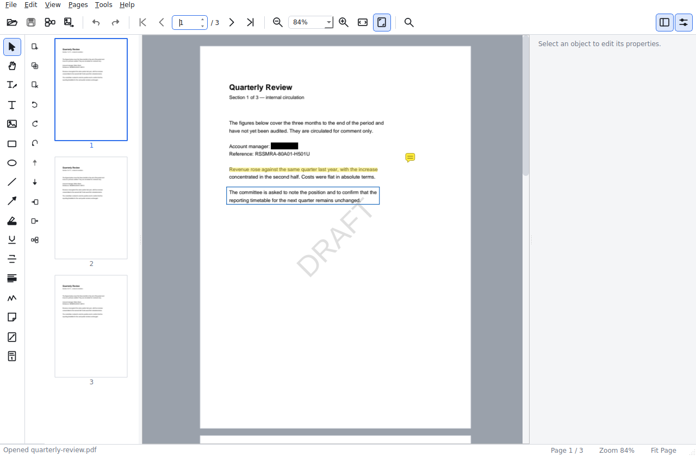
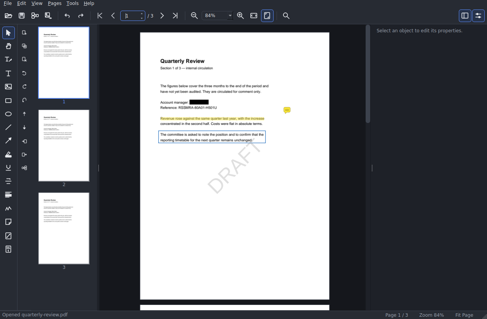

# 📄 Orion — PDF Editor for Desktop

[](https://www.gnu.org/licenses/agpl-3.0)
[](COMMERCIAL-LICENSE.md)
[](https://www.python.org/downloads/)
[](https://github.com/MarcoLombardoDev/Orion/actions/workflows/ci.yml)

An offline PDF viewer, editor, annotator and page organiser. Read documents, add
things to them, annotate them, reorganise their pages — then save a normal PDF that
any other reader can open.

> 🔒 No account. No server. No cloud. No telemetry. Everything happens on your machine,
> and your original file is never touched until you press Save.
> 💼 Commercial or redistribution use (including OEM)? See [COMMERCIAL-LICENSE.md](COMMERCIAL-LICENSE.md),
> or write to [marco.lombardo@gmail.com](mailto:marco.lombardo@gmail.com?subject=Orion%20commercial%20licence%20enquiry).

---

## Screenshots

| | |
|---|---|
| **Light theme** — the editor with the tool palette and the properties panel | **Dark theme** — the same document |
|  |  |

---

## Table of Contents

1. [What Orion is](#what-orion-is)
2. [Features](#features)
3. [Download](#download)
4. [Installation from source](#installation-from-source)
5. [Usage](#usage)
6. [How it works](#how-it-works)
7. [Requirements](#requirements)
8. [Development](#development)
9. [Testing](#testing)
10. [Building a standalone executable](#building-a-standalone-executable)
11. [Troubleshooting](#troubleshooting)
12. [Scope and limitations](#scope-and-limitations)
13. [License & Commercial Licensing](#license--commercial-licensing)
14. [Contributing](#contributing)
15. [Disclaimer](#disclaimer)

---

## What Orion is

Orion is a desktop application for working on PDF documents: read them, add things to
them, annotate them, and reorganise their pages — then save a normal PDF that any other
reader can open.

It is **not** a wrapper around a web service. Everything happens on your machine, and
your original file is never touched until you press Save.

## Features

**Viewing**
- Open, close and reopen recent documents
- Continuous multi-page view with page thumbnails
- First / previous / next / last page, and go-to-page
- Zoom in and out, an exact zoom percentage, fit page and fit width
- Full-document text search with highlighted results

**Editing**
- **Text** — click or drag to place a text box, then edit it in place. Font,
  size, bold, italic, underline, colour, alignment, line spacing, opacity,
  position, size and rotation. Written as real, selectable, searchable PDF text.
- **Images** — insert PNG, JPEG and WEBP, with aspect-ratio locking, opacity
  and free rotation. Drag an image file onto the page to place it.
- **Shapes** — rectangle, ellipse, line and arrow, with stroke colour and
  width, fill colour, opacity and rotation.
- **Annotations** — highlight, underline and strikeout that snap to the
  document's own text lines, freehand drawing, comments and sticky notes.
  All written as standard PDF annotations, so other readers understand them.

**Working with objects**
- Select one or many; drag-select; Ctrl/Cmd-click to extend a selection
- Move, resize from eight handles, and rotate freely (hold Shift to snap)
- Arrow keys nudge, Shift+arrows nudge further
- Cut, copy, paste and duplicate — including between two Orion windows
- Bring to front and send to back
- Unlimited, per-action undo and redo

**Pages**
- Insert a blank page, duplicate, delete
- Reorder by dragging thumbnails
- Rotate 90°, 180° or 270°
- Import pages from another PDF
- Extract pages into a new PDF
- Split a document every N pages or by explicit page ranges
- Merge several PDFs, in an order you choose

**Files**
- Save and Save As, written atomically so an interrupted save cannot damage
  your document
- Crash recovery: unsaved work is snapshotted separately from your PDF
- Light and dark themes

## Download

Standalone builds for **Windows, macOS and Linux** are attached to every
[release](https://github.com/MarcoLombardoDev/Orion/releases):

| Platform | File |
|---|---|
| Windows (x64) | `Orion-<version>-windows-x64.zip` |
| macOS (Apple silicon) | `Orion-<version>-macos-arm64.zip` |
| Linux (x64) | `Orion-<version>-linux-x64.tar.gz` |

Each archive is built on that platform's own runner — PyInstaller does not
cross-compile, so nothing here is emulated or claimed for a platform that was not
actually built. Unpack and run: no installation, and no Python needed.

The builds are **unsigned**, so Windows SmartScreen and macOS Gatekeeper warn on first
launch. On macOS, `xattr -dr com.apple.quarantine Orion.app` clears the warning if you
would rather not click through it.

## Installation from source

Orion needs **Python 3.10 or newer**.

```bash
git clone https://github.com/MarcoLombardoDev/Orion.git
cd Orion
python -m venv .venv
source .venv/bin/activate          # Windows: .venv\Scripts\activate
pip install -e .
orion
```

Or without installing:

```bash
pip install -r requirements.txt
python -m orion
```

Open a document straight away with `orion path/to/file.pdf`, and check the build with
`orion --version`.

### Linux system packages

PySide6 needs a few shared libraries that some minimal images omit:

```bash
sudo apt install libegl1 libgl1 libxkbcommon0 libdbus-1-3 libfontconfig1
```

## Usage

Open a PDF, pick a tool from the palette on the left, and work on the page.
The panel on the right shows the properties of whatever is selected, and the
thumbnails on the left reorder pages by dragging.

A full walkthrough — including every keyboard shortcut — is in
[`docs/USER_GUIDE.md`](docs/USER_GUIDE.md).

The shortcuts you will use most:

| | |
|---|---|
| `Ctrl/Cmd + O` | Open |
| `Ctrl/Cmd + S` | Save |
| `Ctrl/Cmd + Shift + S` | Save As |
| `Ctrl/Cmd + Z` / `Ctrl/Cmd + Y` | Undo / Redo |
| `Ctrl/Cmd + C` / `V` / `X` / `D` | Copy / Paste / Cut / Duplicate |
| `Ctrl/Cmd + F` | Find |
| `Ctrl/Cmd + 1` / `2` / `0` | Fit page / Fit width / 100% |
| `V` `H` `T` `I` `R` `O` `L` `A` `P` `N` | Pick a tool |
| `Delete` | Delete the selection |
| `Esc` | Cancel the current operation |

## How it works

### Architecture

```
UI  (orion/ui)            Qt widgets, the canvas, the panels
        │
Commands (orion/commands) undo/redo — deltas, not snapshots
        │
Document (orion/document) Document · Page · Text/Image/Shape/Annotation
        │
PDF engine (orion/pdf)    reader · renderer · writer · operations
        │
pypdfium2 · pypdf · reportlab · Pillow
```

The rule the whole design follows: **the UI never manipulates the PDF file.**
It edits an in-memory document model; the file is read for rendering and
written only when you save. That is what makes undo cheap, autosave a
serialisation, and your original file safe.

`orion/document`, `orion/commands` and `orion/utils` do not import Qt at all,
so the model is testable without a display. CI proves it rather than trusting the
convention: a job installs every dependency *except* PySide6 and imports those layers.

The full reasoning, the coordinate system, and the known technical risks are in
[`docs/ARCHITECTURE.md`](docs/ARCHITECTURE.md).

### Where files are stored

Orion keeps nothing beside your documents. Settings, the recent-files list and crash
recovery snapshots live in the platform's own application-data directory
(`%APPDATA%` on Windows, `~/Library/Application Support` on macOS,
`$XDG_CONFIG_HOME` on Linux). A recovery snapshot is written next to that state, never
over your PDF.

## Requirements

- **Python 3.10 or newer** (source install only — the released builds bundle their own)
- A desktop environment; on Linux, the shared libraries listed under
  [Installation from source](#linux-system-packages)

| Dependency | Purpose |
|---|---|
| PySide6 ≥ 6.6 | The interface |
| pypdfium2 ≥ 4.30 | Rendering pages, extracting and searching text |
| pypdf ≥ 4.0 | Assembling documents, page operations, annotations |
| reportlab ≥ 4.0 | Drawing added text, shapes and images |
| Pillow ≥ 10.0 | Image decoding for inserted pictures |

## Development

```bash
pip install -e ".[dev]"
ruff check orion tests       # lint
```

`docs/DEVELOPMENT.md` covers the layout, the conventions and how to add a new
object type or tool. `CONTRIBUTING.md` covers the contribution process.

## Testing

```bash
pytest                       # the whole suite, GUI tests included
```

The GUI tests drive the real widgets, so they need a display. On a headless
machine set `QT_QPA_PLATFORM=offscreen`:

```bash
QT_QPA_PLATFORM=offscreen pytest
```

CI runs the suite on Linux, Windows and macOS, on Python 3.10 and 3.12, plus a lint job
and the Qt-free-layers check described under [How it works](#architecture).

## Building a standalone executable

```bash
pip install . pyinstaller
pyinstaller --noconfirm --clean orion.spec
```

The result lands in `dist/Orion/` — `dist/Orion.app` as well, on macOS. It is native to
whatever machine built it: **PyInstaller does not cross-compile**, so a Windows `.exe`
needs Windows, a Mach-O binary needs macOS, and an ELF binary needs Linux.

Without three machines, `.github/workflows/release.yml` is the way to get all three.
Push a `v*` tag, or run the workflow by hand from the Actions tab and give it the tag:
it builds on `windows-latest`, `macos-latest` and `ubuntu-latest`, smoke-tests every
bundle with `--version` before publishing it, and attaches one archive per platform to
the release.

## Troubleshooting

| Symptom | Cause and fix |
|---|---|
| `ImportError` mentioning `libEGL` or `libxkbcommon` on Linux | The Qt shared libraries are missing — install the packages under [Linux system packages](#linux-system-packages). |
| The application starts and immediately exits on a headless machine | There is no display. Set `QT_QPA_PLATFORM=offscreen` for tests; the editor itself needs a real one. |
| Windows SmartScreen or macOS Gatekeeper blocks the download | The builds are unsigned. See [Download](#download). |
| Text added to a page is not selectable in another reader | Only text placed with the Text tool is written as real PDF text. Freehand ink and comments are annotations by design. |
| A saved file looks different in another viewer | Report it with the source document attached, if you can share it — differences between PDF writers are the kind of bug worth a test. |

## Scope and limitations

Orion 1.0 deliberately stops at a solid, offline editor.

Not yet, but planned:

- Several documents open at once, in tabs
- Embedding arbitrary TrueType fonts in text objects (1.0 uses the base-14 PDF fonts)
- Optional OCR through Tesseract, as a separate module
- Form field editing
- Editing the *original* text of a PDF, not only the text Orion adds

Explicitly out of scope, permanently: AI features, cloud sync, accounts, telemetry.

## License & Commercial Licensing

Orion is open-source software released under the
**[GNU Affero General Public License v3.0 (AGPL-3.0)](LICENSE)**.

Copyright © 2026 Marco Lombardo.

**The free build is the whole product.** Every feature documented above is in it.
There is no paid edition, no feature gate, no licence key, no seat limit and no
phone-home. If AGPL-3.0 works for you, you are done reading — Orion is yours to use.

### What AGPL-3.0 Means for You

| Use Case | Allowed? | Obligation |
|---|---|---|
| Internal use, any number of machines and users | ✅ Yes | None |
| Modify it and keep the changes to yourself | ✅ Yes | None |
| Fork and publish on GitHub | ✅ Yes | Must stay AGPL-3.0 |
| Redistribute it, modified or not, under AGPL-3.0 | ✅ Yes | Must ship the source |
| Deploy a modified version as a network service | ✅ Yes | Must publish the source of your modified version |
| Integrate into a **closed-source product** used internally | ⚠️ Restricted | Requires a Commercial licence |
| Offer as a **proprietary SaaS** without sharing source | ❌ Not under AGPL | Requires a Redistribution licence |
| Embed it in, or ship it inside, a product you **sell to third parties** | ❌ Not under AGPL | Requires a Redistribution licence |

The dividing line is one rule: **AGPL-3.0 is free as long as the source stays open.**

### Commercial Licensing

The commercial offer removes the copyleft obligation, and nothing else. It splits into two
branches that answer different questions — **Commercial**, sized by how big the
organisation using Orion internally is, and **Redistribution**, needed whenever the
software (or a derivative) reaches third parties, regardless of size:

```
Community         AGPL-3.0, free
Commercial        Small (1–49 employees) · Medium (50–249) · Large (250–999) · Enterprise (1,000+ / group)
Redistribution    Standard · Enterprise
```

| Tier | Price | Perpetual | Scope |
|---|---:|---:|---|
| **Community** | **Free** | — | Everything Orion does, under AGPL-3.0. Unlimited internal use. |
| **Commercial — Small** | **€900 / year** | €2,700 | 1–49 employees, internal use, one legal entity. |
| **Commercial — Medium** | **€1,800 / year** | €5,400 | 50–249 employees, internal use, one legal entity. |
| **Commercial — Large** | **€3,200 / year** | €9,600 | 250–999 employees, internal use, one legal entity. |
| **Commercial — Enterprise** | **from €5,500 / year** | — | 1,000+ employees, or a Corporate Group scope. |
| **Redistribution — Standard** | **€2,900 / year** | €8,700 | Embed it in a product you sell, or ship it to customers. |
| **Redistribution — Enterprise** | **from €10,000 / year** | — | Large-scale distribution — worldwide, high volume, or OEM. |

A perpetual licence is three times the annual rate of the same tier, bought once, covering
the major version current at purchase. Both Enterprise tiers are negotiated per case
instead.

The same commitments apply at every paid tier:

- **Email support is always included** — 5 business days at Commercial Small down to 2 at
  either Enterprise tier. It is never sold separately to a paying customer.
- **Custom development is never included**, at any tier. It is available on request and
  **quoted separately**, per project, at a fixed price agreed before work starts
  (indicative day rate: **€500 / day**).
- **No retroactive price rise, cancel any time.** Versions released during your term stay
  licensed to you.
- **50% off** for organisations under 10 employees and €1M revenue. **Free** commercial
  licences for non-profits, academia and published research — ask.

A Commercial licence, below Enterprise, covers exactly one legal entity: it does not
automatically extend to other companies in the same group, and it does not include
redistribution, OEM or embedding rights — those need a Redistribution licence on top.
Prices are per licensed legal entity, excluding VAT. **Seats are never counted.** Full
terms, the Employee Count and Corporate Group definitions, and the third-party component
review: **[COMMERCIAL-LICENSE.md](COMMERCIAL-LICENSE.md)**.

> ⚠️ **One dependency is not permissively licensed.** PySide6 is offered under
> LGPL-3.0, GPL-2.0 or GPL-3.0. A commercial licence to Orion covers Orion's own
> code and cannot relicense it: its terms stay between you and The Qt Company.
> Everything else — the PDF engine included — is BSD, MIT or Apache. The full
> table is in [§11](COMMERCIAL-LICENSE.md#11-third-party-components), and every
> component in a build is inventoried in
> [THIRD-PARTY-LICENSES.md](THIRD-PARTY-LICENSES.md).

### How to get in touch

Everything commercial — buying a licence, asking for a quote, commissioning custom
development, or checking whether you need a licence at all (the answer is often *no*) —
goes to one address:

> **[marco.lombardo@gmail.com](mailto:marco.lombardo@gmail.com?subject=Orion%20commercial%20licence%20enquiry)** — Marco Lombardo

Please keep **GitHub Issues for bugs and feature requests**, not for licensing.

## Contributing

Contributions are welcome. All contributors must agree to the
[Contributor License Agreement (CLA)](CLA.md) before a Pull Request can be merged. The CLA
grants the Project Owner the right to dual-license contributions under AGPL-3.0 and
commercial terms — this is what makes the dual-licensing model sustainable.

> **To agree to the CLA:** include
> `I have read and agree to the Contributor License Agreement (CLA.md).`
> in your Pull Request description.

Practical expectations:

- Orion is an **offline desktop application**. Contributions adding network access,
  accounts, telemetry, analytics, cloud storage or a licensing system will not be
  merged, however well written.
- `orion/document`, `orion/commands` and `orion/utils` must stay Qt-free; CI proves
  it by importing them without PySide6 installed.
- Every bug fix arrives with a test that fails without the fix.
- Bump the version in `pyproject.toml` and `orion/__init__.py`, and add a
  `CHANGELOG.md` entry.

[`CONTRIBUTING.md`](CONTRIBUTING.md) covers the process in full, and
[`docs/DEVELOPMENT.md`](docs/DEVELOPMENT.md) the layout and conventions.

## Disclaimer

Orion **edits and rewrites PDF documents**. It never touches your original file
until you press Save, and Save As leaves it alone entirely — but no safety net
replaces your own backups, and a PDF written by any tool can differ from the
original in ways a viewer does not show.

Before editing something irreplaceable:

1. work on a copy, or use **Save As** rather than Save,
2. reopen the result and check it in a second reader,
3. keep an independent backup of the original.

The software is provided **"as is", without warranty of any kind**, as set out in
sections 15 and 16 of the AGPL-3.0. The authors accept no liability for data loss or
for any damage arising from its use.

---

*Copyright © 2026 Marco Lombardo. Licensed under AGPL-3.0 — commercial licensing available.*
